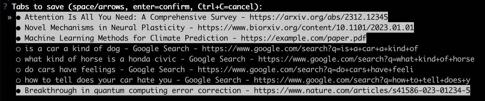
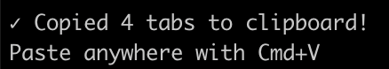
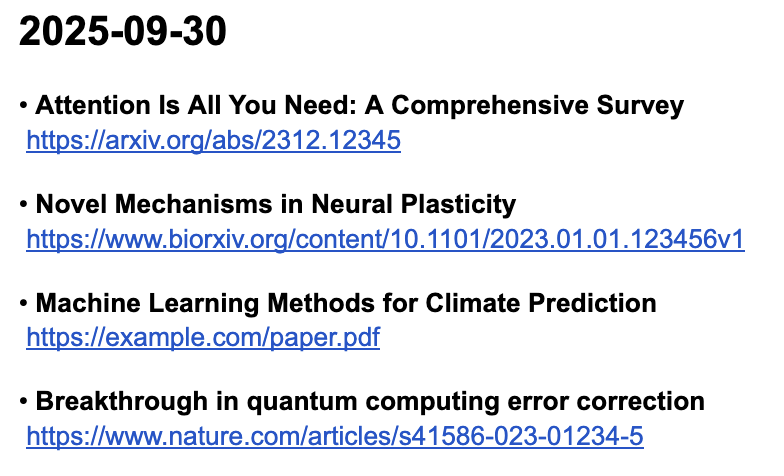

Saves open pdf/arxiv/bioarxiv/nature/cell/etc tabs to your clipboard for easy pasting.

Not user-friendly at all lol look I built this for myself sorry, maybe you'll find
utility if you are drowning in open arxiv tabs like I always am

**Requirements:** macOS with Google Chrome

## Easiest: One command to run

Open Terminal (or iTerm) and run:

```bash
# Install uv if you don't have it
curl -LsSf https://astral.sh/uv/install.sh | sh

# Run tab-reaper
uvx --from git+https://github.com/kpich/tab-reaper.git tab-reaper
```

Then:

1. Select tabs to save (PDFs/arxiv/biorxiv/nature/pubmed pre-selected, space to toggle, enter to confirm)

   

2. Tabs are copied to your clipboard

   

3. Paste anywhere with Cmd+V (here's what it looks like when pasted)

   

4. Optionally close all copied tabs (hit `y` to close them)

   

## More complicated: Installing + running separately

**Option 1: Using uv**
```bash
uv tool install git+https://github.com/kpich/tab-reaper.git
tab-reaper
```

**Option 2: Manual installation**
```bash
git clone https://github.com/kpich/tab-reaper.git
cd tab-reaper
# In a venv or conda environment:
pip install .
tab-reaper
```
